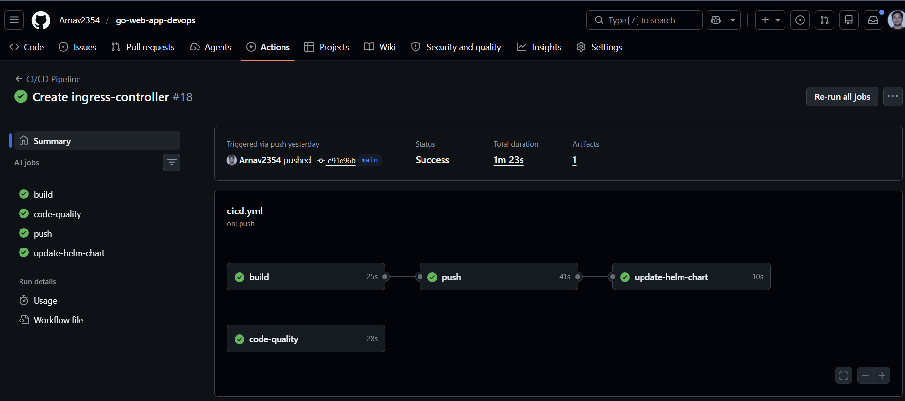
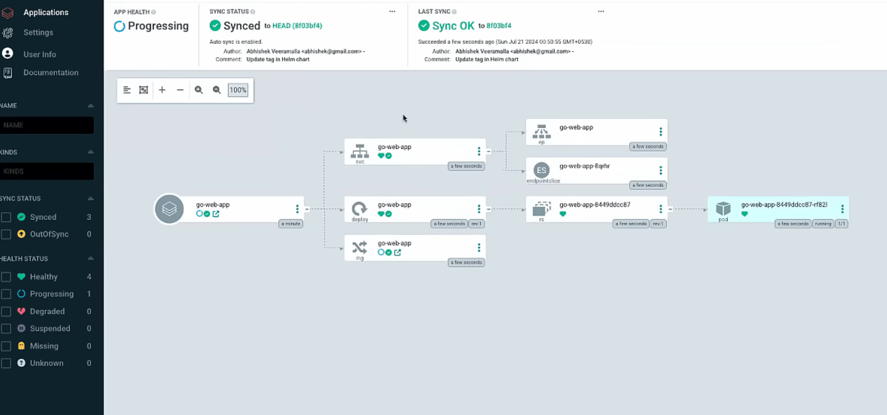
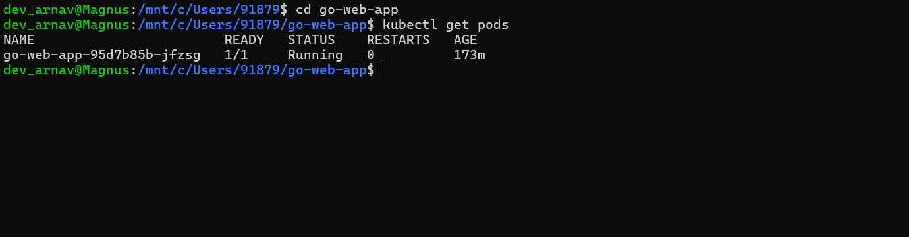
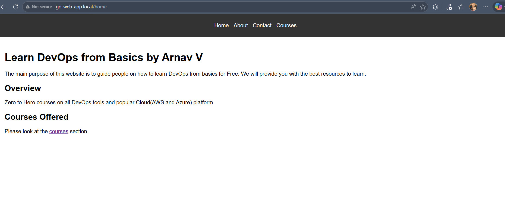

# 🚀 End-to-End DevOps Pipeline — Go Web Application


vim README.md


> A production-grade DevOps implementation of a Go web application featuring automated CI/CD, GitOps-based deployment, Helm chart management, and cloud deployment on AWS EKS.

---

## 📸 Project Screenshots

### ✅ GitHub Actions CI/CD Pipeline — Successful Run


> Pipeline completes in **1m 23s** with 4 stages: `build` → `push` → `update-helm-chart` + `code-quality`

### 🔄 ArgoCD — GitOps Continuous Delivery

> ArgoCD automatically syncs Kubernetes cluster with GitHub on every image tag update. Status: **Synced ✅ | Healthy ✅**

### 🟢 Kubernetes Pod Running on EKS

```
NAME                          READY   STATUS    RESTARTS   AGE
go-web-app-95d7b85b-jfzsg     1/1     Running   0          173m
```

### 🌐 Live Application

> Go web application serving DevOps learning content — accessible via Kubernetes Ingress at `go-web-app.local`

---

## 🏗️ Architecture

```
Developer (git push)
        │
        ▼
   GitHub (main branch)
        │
        ▼
┌─────────────────────────────────┐
│      GitHub Actions CI/CD       │
│                                 │
│  ┌─────────┐  ┌──────────────┐  │
│  │  build  │  │ code-quality │  │
│  └────┬────┘  └──────────────┘  │
│       │                         │
│  ┌────▼────┐                    │
│  │  push   │ → DockerHub        │
│  └────┬────┘   (arnav2354/      │
│       │         go-web-app)     │
│  ┌────▼──────────────┐          │
│  │ update-helm-chart │          │
│  └───────────────────┘          │
└─────────────────────────────────┘
        │ (image tag updated in GitHub)
        ▼
┌─────────────────────────────────┐
│         ArgoCD (GitOps)         │
│  Watches GitHub → Auto Syncs   │
│  to EKS on every tag change     │
└─────────────────────────────────┘
        │
        ▼
┌─────────────────────────────────┐
│        AWS EKS Cluster          │
│  us-east-1                      │
│                                 │
│  ┌─────────────────────────┐    │
│  │   go-web-app pod        │    │
│  │   1/1 Running           │    │
│  └─────────────────────────┘    │
│  ┌─────────────────────────┐    │
│  │   NGINX Ingress         │    │
│  │   go-web-app.local      │    │
│  └─────────────────────────┘    │
└─────────────────────────────────┘
```

---

## 🛠️ Tech Stack

| Category | Technology | Purpose |
|----------|-----------|---------|
| **Application** | Go (Golang) 1.21 | Web server using net/http |
| **Containerization** | Docker (Multi-stage) | Lightweight production image |
| **Orchestration** | Kubernetes | Container management |
| **Cloud** | AWS EKS (us-east-1) | Managed Kubernetes cluster |
| **CI** | GitHub Actions | Automated build, test, push |
| **CD** | ArgoCD (GitOps) | Automatic sync to EKS |
| **Package Manager** | Helm Charts | Multi-env K8s deployments |
| **Registry** | DockerHub | Container image storage |
| **Ingress** | NGINX Ingress Controller | External traffic routing |
| **Version Control** | Git + GitHub | Source code management |

---

## 🔄 CI/CD Pipeline

### Pipeline Stages (GitHub Actions)

```
┌──────────┐    ┌──────────────┐    ┌────────┐    ┌───────────────────┐
│  build   │───▶│ code-quality │    │  push  │───▶│ update-helm-chart │
│  25s ✅  │    │   28s ✅     │    │ 41s ✅ │    │      10s ✅       │
└──────────┘    └──────────────┘    └────────┘    └───────────────────┘
     │                                   ▲
     └───────────────────────────────────┘
```

| Stage | What it does | Duration |
|-------|-------------|---------|
| `build` | Compiles Go binary, runs unit tests | 25s |
| `code-quality` | Static analysis and code checks | 28s |
| `push` | Builds multi-stage Docker image, pushes to DockerHub with Git SHA tag | 41s |
| `update-helm-chart` | Updates image tag in Helm values, commits back to GitHub | 10s |

**Total pipeline time: 1m 23s** ⚡

### GitOps Flow (ArgoCD)

```
GitHub (image tag updated)
        │
        ▼
ArgoCD detects change
        │
        ▼
Auto sync triggered
        │
        ▼
EKS cluster updated
(zero downtime rolling update)
        │
        ▼
App live ✅
```

---

## 📁 Repository Structure

```
go-web-app-devops/
├── .github/
│   └── workflows/
│       └── cicd.yml              # GitHub Actions pipeline
├── helm/
│   └── go-web-app-chart/
│       ├── Chart.yaml            # Helm chart metadata
│       ├── values.yaml           # Default configuration
│       └── templates/
│           ├── deployment.yaml   # K8s Deployment template
│           ├── service.yaml      # K8s Service template
│           └── ingress.yaml      # K8s Ingress template
├── k8s/
│   └── manifests/
│       ├── deployment.yaml       # Kubernetes Deployment
│       ├── service.yaml          # Kubernetes Service
│       └── ingress.yaml          # Kubernetes Ingress
├── static/
│   ├── home.html
│   ├── courses.html
│   ├── about.html
│   └── contact.html
├── .gitignore
├── Dockerfile                    # Multi-stage Docker build
├── go.mod                        # Go module definition
├── main.go                       # Application entry point
└── main_test.go                  # Unit tests
```

---

## 🚀 Running Locally

### Prerequisites
```bash
# Install Go 1.21+
# Install Docker
# Install kubectl
# Install Helm 3.x
```

### Run the app
```bash
# Clone the repo
git clone https://github.com/Arnav2354/go-web-app-devops
cd go-web-app-devops

# Run directly
go run main.go

# Access at http://localhost:8080
```

### Run with Docker
```bash
# Build image
docker build -t go-web-app:local .

# Run container
docker run -p 8080:8080 go-web-app:local

# Access at http://localhost:8080
```

### Run tests
```bash
go test ./...
```

---

## ☸️ Deploying to Kubernetes

### With Helm
```bash
# Add your EKS cluster context
aws eks update-kubeconfig --name go-web-app-cluster --region us-east-1

# Deploy with Helm
helm upgrade --install go-web-app ./helm/go-web-app-chart \
  --set image.tag=<your-image-tag>

# Verify deployment
kubectl get pods
# go-web-app-95d7b85b-jfzsg   1/1   Running   0   173m
```

### With kubectl
```bash
kubectl apply -f k8s/manifests/
```

---

## 🔐 GitHub Secrets Required

| Secret | Description |
|--------|-------------|
| `DOCKERHUB_USERNAME` | DockerHub username (`arnav2354`) |
| `DOCKERHUB_TOKEN` | DockerHub access token |
| `AWS_ACCESS_KEY_ID` | IAM user access key |
| `AWS_SECRET_ACCESS_KEY` | IAM user secret key |
| `KUBECONFIG` | EKS cluster kubeconfig |

---

## 🌟 Key Features

- ✅ **Multi-stage Docker build** — minimal, secure production image
- ✅ **Automated CI/CD** — pipeline triggers on every push to main
- ✅ **GitOps with ArgoCD** — zero manual kubectl apply needed
- ✅ **Helm chart** — configurable multi-environment deployments
- ✅ **NGINX Ingress** — custom domain routing (`go-web-app.local`)
- ✅ **Health checks** — liveness and readiness probes on all pods
- ✅ **Rolling updates** — zero downtime deployments
- ✅ **Unit tested** — Go httptest validates all HTTP handlers

---

## 📊 Pipeline Stats

| Metric | Value |
|--------|-------|
| Total pipeline time | ~1m 23s |
| Docker image size | < 50MB |
| Test coverage | All HTTP handlers |
| Deployment strategy | Rolling update |
| Cloud region | us-east-1 |
| Kubernetes pods | 1/1 Running |

---

## 👨‍💻 Author

**Arnav Verma**  
🐳 DockerHub: [arnav2354](https://hub.docker.com/u/arnav2354)  
🐙 GitHub: [Arnav2354](https://github.com/Arnav2354)

---

## 📄 License

This project is licensed under the Apache 2.0 License — see the [LICENSE](LICENSE) file for details.
